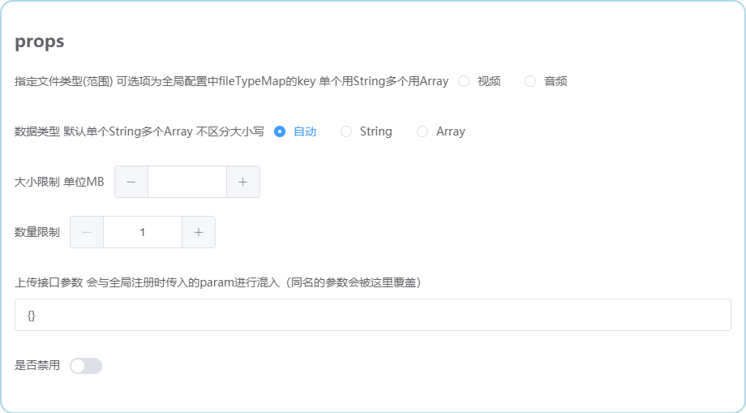

# filepool / 文件上传池


<br/>



<br/>

### Features

- √ v-model双绑
- √ 支持分片上传/断点续传 分片大小可配
- √ 支持上传进度显示、中途取消
- √ 支持格式限制/大小限制/数量限制 可针对不同类型分别设置
- √ 自动根据数量限制选择String或Array数据类型 也可以手动指定
- √ 支持拖拉拽排序（响应式）
- √ 支持上传后预览/禁用时预览
- √ 支持element-ui中el-form的全局disabled
- √ 全局安装/局部引入 通用参数仅需配置一次

<br/>

### Installation

``` bash
$ yarn add filepool
```

**Dependencies**：vue element-ui [axios（如果需要分片）]

```js
import Filepool from 'filepool'

// 组件内引入
components: { Filepool }

// 全局引入
Vue.use(Filepool, { url: '接口地址' })
```

<br/>

### Usage

```html
<Filepool v-model="" fileType="video"/>
```

| Attribute | Description | Configuration Mode | Type | Accepted Values | Default |
| --- | --- | --- | --- | --- | --- |
| value / v-model | 文件链接 | props | string / array | | |
| url | 上传接口地址 | global | string | | |
| request | axios实例，如不传则获取文件本身 | global, props | function | | |
| requestConfig | axios配置 | global | object | | *see below* |
| chunk | 是否分片 | global | boolean | | true |
| chunkSize | 分片大小 单位MB | global | number | | 10 |
| fileType | 指定文件类型（范围） | props | string | 全局配置中fileTypeMap的key 单个用string多个用array | |
| fileTypeMap | 文件类型配置 | global | object | | *see below* |
| valueType | 数据类型 | props | string | 'string' / 'array' | *see below* |
| maxSize | 大小限制 单位MB | global, props | number | | 200 |
| count | 数量限制 | global, props | number | | 1 |
| param | 上传接口参数（除二进制文件以外的其他参数 二进制文件默认会以file作为参数名） | global, props | object | | |
| disabled | 是否禁用 | props | boolean | | false |
| localProxy | 本地代理 | global | object | | |
| proxy | 代理 | global | object | | |
| delConfirmation | 是否在删除文件时弹框确认 | global | boolean | | false |
| base64Encoding | 在没有配置request时，是否将文件进行base64编码 | global, props | boolean | | false |
| placeholder | 提示信息（hint） | global, props | string | | '点击上传[（支持格式：mp4）]' |

<br/>

文件形态：

- url: 配置了url和request时进入该模式
- 二进制File: 没有配置url或request时进入该模式
- base64: 没有配置url或request，且将base64Encoding设置为true时进入该模式

<br/>

文件数据类型：

- auto（默认）: count为1时采用string，count>1时采用array
- string: 字符串类型，count为1时采用string，count＞1时采用json-string
- array: 数组类型

<br/>

requestConfig

默认值：
```json
{
  "baseURL": "", //针对prod环境中baseApi为相对路径的情况
  "method": "POST",
  "timeout": 0
}
```

比如你想将超时时间修改为10秒：

```js
Vue.use(Imgpond, {
  requestConfig: {
    timeout: 10000
  }
})
```

<br/>

fileTypeMap默认值

```js
fileTypeMap: {
  image: {
    format: ['jpg', 'jpeg', 'png'],
    maxSize: 10,
  },
  video: {
    format: ['mp4'],
    maxSize: 200
  },
  audio: {
    format: ['mp3', 'wav'],
    maxSize: 60
  },
  apk: {
    format: ['apk'],
    maxSize: 200
  },
  excel: {
    format: ['xlsx', 'xls'],
    maxSize: 100
  },
}
```

<br/>

获取上传进度：

1. 添加一个ref如filepool
2. this.$refs.filepool?.percentage < 100 // 小于100表示上传中，等于100表示未开始/上传完毕

<br/>

### Notice

- maxSize权重排序：props ＞ fileTypeMap中对应的maxSize ＞ 全局配置的maxSize

- 全局配置被props中的同名参数覆盖 对象会进行混入

- 如果仅上传图片 请使用imgpond

- fileType如果为Array类型 必须以引用data中变量的形式来传入
  - 这是因为每次父组件重渲染时 直接写在template中的引用型变量会被重新创建 导致意外触发组件内的监听
  - 详见 https://github.com/vuejs/vue/issues/9223
